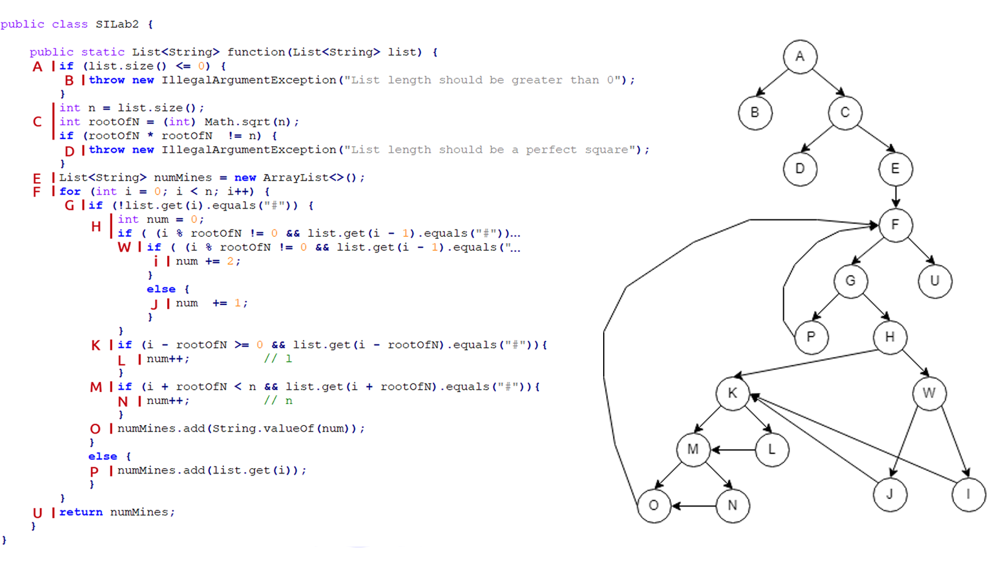

# Димитар Јовановски, 203099

## Control Flow Graph  

## Цикломатска комплексност
Цикломатската комплексност за овој код е 9. До резултатот стигнав преку функцијата V(G)=P+1 т.ш. во графот постојат 8 предикатни јазли(P=8), што резултира со цикломатската комплексност од 9. 

## Тест случаи според критериумот Every statement
|C0 |/   |## |#0#0|
|---|----|---|----|
|A  |X   |X  |X   |
|B  |X   |   |    |
|C  |    |X  |X   |
|D  |    |X  |    |
|E  |    |   |X   |
|F  |    |   |X   |
|G  |    |   |X   |
|H  |    |   |X   |
|W  |    |   |X   |
|I  |    |   |X   |
|J  |    |   |X   |
|K  |    |   |X   |
|L  |    |   |X   |
|M  |    |   |X   |
|N  |    |   |X   |
|O  |    |   |X   |
|P  |    |   |X   |
|U  |    |   |X   |

## Тест случаи според критериумот Every path
Во овој случај, не е возможно да се откријат сите можни патишта на кодот зависно влезните податоци, затоа што секоја влезна листа со n^2 број на јазли ќе е инпут кој ќе влезе во for циклусот, што значи дека на овој начин возможни се ∞ број патеки. Но ако го гледаме control flow графот(од второ прашање) како обичен насочен граф и претпоставиме дека влезниот податок е листа со 1 јазол што значи дека for циклусот ќе има една итерација т.е после второто поминување низ јазол F, директно оди кон јазол U, може да заклучиме дека можни се вкупно 17 патеки.

## Објаснување на напишаните unit tests
Вкупно во SILabTest класата се наведени 4 тестови(првиот од примерот на лаб. останатите се горенаведени). Се користи класата Assertions и со нејзината метода се испробуваат случаевите.  
Разликата е во типот на метода користена. Ако се споредуваат влезните со излезни податоци се користи .assertEquals методата, но ако очекуваниот излез е исклучок, тогаш се користи .assertThrows методата. Во случајов сите 4 тестови поминуваат како точни.